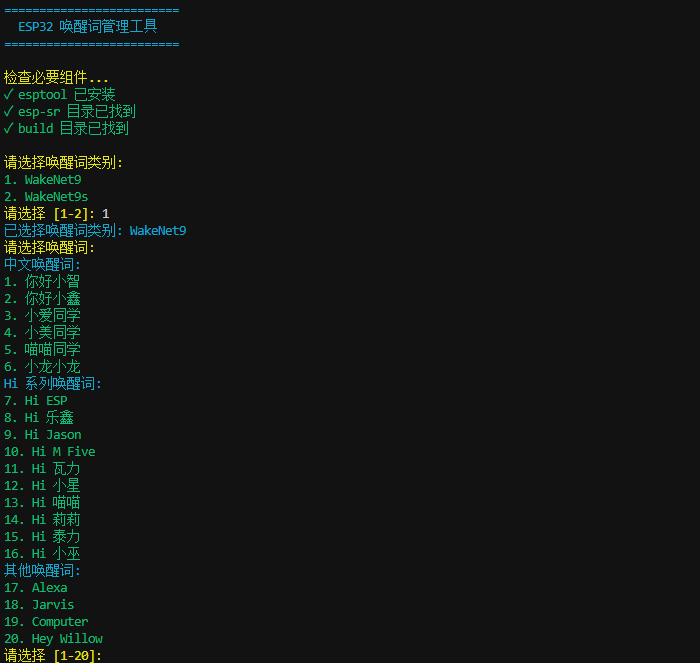
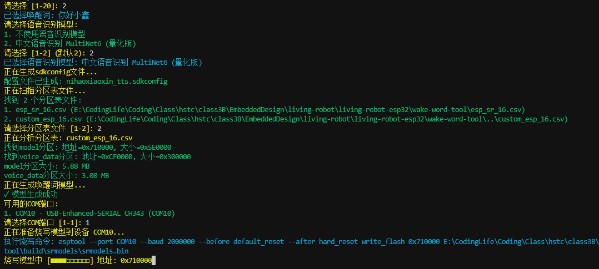
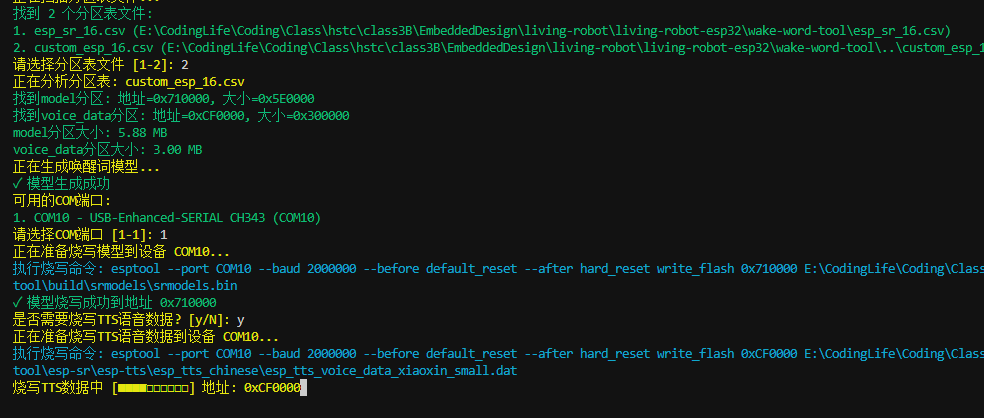

<!-- ESP-SR-Model-Tool -->
<h1 align="center">ESP-SR-Model-Tool</h1>

<p align="center">
  
  
  <br>
  <a href="https://opensource.org/licenses/Apache2.0"></a>
  
</p>

一个用于ESP32系列芯片的语音识别模型管理工具，帮助开发者轻松配置、生成和烧写唤醒词模型。
[English](./README.en.md) | [中文](#中文介绍)



ESP-SR-Model-Tool 是一个易于使用的ESP32语音识别模型配置工具，可以帮助您快速选择、生成和烧写各种唤醒词模型到您的ESP32设备。无需手动配置复杂的参数，只需几个简单的步骤即可完成唤醒词的部署。

### ✨ 功能特点

- 📋 **直观的交互式界面** - 通过命令行交互轻松选择唤醒词和配置
- 🔊 **丰富的唤醒词支持** - 支持WakeNet9和WakeNet9s中所有官方唤醒词
- 📊 **分组分类展示** - 按中文、英文等类别分组展示唤醒词，便于选择
- 🔍 **智能分区表解析** - 自动扫描并解析项目中的分区表获取正确地址
- 📝 **动态生成配置** - 自动生成sdkconfig配置文件
- 📈 **实时进度显示** - 烧写过程中以动画进度条形式展示进度
- 🔌 **多平台支持** - 兼容Windows、Linux和macOS系统
- 🌐 **语音识别支持** - 可选配置语音识别模型(MultiNet)
- 🔄 **TTS数据烧写** - 支持烧写TTS语音合成数据

### 🛠️ 安装与依赖

在使用此工具前，请确保安装所需的Python依赖：

```bash
# 克隆仓库
git clone https://github.com/yourusername/esp-sr-model-tool.git
cd esp-sr-model-tool

# 安装依赖
pip install -r requirements.txt

```

您还需要：

1. 已安装ESP-IDF或Arduino ESP32开发环境
2. ESP-SR库（需放置在wake-word-tool/esp-sr目录）
3. 已安装esptool工具（`pip install esptool`）

### 🚀 使用方法

1. 确保您的ESP32已通过USB连接到电脑
2. 运行以下命令启动工具：

```bash
python main.py
```

3. 按照交互式界面提示操作：
   - 选择唤醒词类别（WakeNet9或WakeNet9s）
   - 选择具体的唤醒词
   - 选择语音识别模型（可选）
   - 选择分区表文件
   - 选择串口设备
   - 等待模型生成和烧写完成

### ⚠️ 注意

> 当你用PlatfromIO开发 可使用platform: `platform-espressif32.zip` 本压缩包已经修复其中的唤醒词硬编码（`hiesp`） // 不改变则不会替换唤醒词模型，`MN...`模型同理

<details>
   <summary>
   platformio.ini 文件参考
   </summary>

```ini
[env:slef-esp32-s3]
platform = <xxxx/platform-espressif32.zip>
board = esp32-s3-devkitc-1
framework = arduino
; lib_ldf_mode = deep+
monitor_speed = 115200
# 此处为含有model分区的分区表文件
board_build.arduino.partitions = esp-sr.csv
board_build.f_cpu = 240000000L
board_build.arduino.memory_type = qio_opi
board_upload.flash_size = 16MB
build_flags =
 -DBOARD_HAS_PSRAM
 -DCONFIG_USE_WAKENET
```

</details>

#### 🖼️ 使用效果

> 请确保您的ESP32设备已烧写了最新固件，并连接到电脑上。




#### 命令行参数使用

高级用户可以通过命令行参数直接指定配置，无需交互式选择：

```bash
python main.py -c xiaoaitongxue.sdkconfig -p COM3 -b 2000000 -t -y
```

可用的命令行参数：

| 参数 | 说明 |
| ---- | ---- |
| `-c`, `--config` | 指定唤醒词配置文件路径 (.sdkconfig) |
| `-p`, `--port` | 指定串口设备 (如 COM3 或 /dev/ttyUSB0) |
| `-b`, `--baud` | 指定波特率 (默认: 2000000) |
| `-t`, `--tts` | 同时烧写TTS语音数据 |
| `-y`, `--yes` | 自动确认所有操作，无需用户确认 |
| `-a`, `--address` | 直接指定模型烧写地址 (例如 0x710000) |

例如，要自动烧写"小爱同学"唤醒词并同时烧写TTS数据：

```bash
python main.py -c xiaoaitongxue.sdkconfig -p COM3 -t -y
```

### 📋 支持的唤醒词

工具支持所有ESP官方提供的唤醒词，包括：

**中文唤醒词**：

- 你好小智、你好小鑫、小爱同学
- 小美同学、喵喵同学、小龙小龙
- 小宇同学、小明同学、小康同学
- 小滨小滨、小鸭小鸭、璃奈板
- 小酥肉、小箭小箭、小特小特
- 及更多...

**英文/Hi系列唤醒词**：

- Hi ESP、Hi 乐鑫、Hi Jason
- Hi M Five、Hi 瓦力、Hi 小星
- Hi 喵喵、Hi 莉莉、Hi 泰力
- Hi 小巫、及更多...

**其他唤醒词**：

- Alexa、Jarvis、Computer
- Hey Willow、Sophia、Mycroft
- Hey Printer、Hi Joy、Hey Wanda
- Astrolabe、及更多...

### 📄 分区表配置

工具会自动查找项目目录中的分区表文件，并解析出正确的模型和语音数据烧写地址。典型的分区表条目示例：

```
# Name, Type, SubType, Offset, Size
nvs,data,nvs,0x9000,0x6000
phy_init,data,phy,0xf000,0x1000
factory,app,factory,0x10000,1M
model,data,spiffs,0x710000,0x5E0000
voice_data,data,fat,0xCF0000,0x300000
```

工具将自动使用model分区的偏移量（0x710000）作为烧写地址。

如果无法找到分区表或分区表中没有model分区，工具将使用默认地址（0x710000）。

### ❓ 常见问题解答

1. **如何获取ESP-SR库？**
   - 可以从乐鑫官方GitHub下载：[esp-sr](https://github.com/espressif/esp-sr)
   - 也可以使用本项目提供的ESP-SR压缩包

2. **找不到唤醒词配置文件？**
   - 新版工具会自动生成配置文件，无需手动创建
   - 如需使用现有配置，确保文件后缀为`.sdkconfig`
   - 检查配置文件中是否包含正确的唤醒词配置项

3. **遇到文件编码错误？**
   - 工具支持多种编码格式 (UTF-8, GBK, GB2312, Latin1, CP1252)
   - 如有问题，使用记事本打开sdkconfig文件，另存为UTF-8编码

4. **找不到COM端口？**
   - 检查设备连接是否正常
   - 确认驱动是否正确安装
   - 使用`-p`参数手动指定端口

5. **模型生成失败？**
   - 确认esp-sr目录结构是否正确
   - 检查esp-sr/model目录中是否包含movemodel.py脚本

6. **烧写失败？**
   - 尝试降低波特率 (`-b 115200`)
   - 有些ESP32需要手动进入下载模式（按住BOOT按钮后按RST）
   - 检查驱动是否正确安装

### 🤝 贡献

欢迎贡献代码、报告问题或提出改进建议！请遵循以下步骤：

1. Fork 本仓库
2. 创建您的特性分支 (`git checkout -b feature/amazing-feature`)
3. 提交您的更改 (`git commit -m 'Add some amazing feature'`)
4. 推送到分支 (`git push origin feature/amazing-feature`)
5. 开启一个 Pull Request

### 📜 许可证

本项目采用 Apache License 许可证 - 详情请参阅 [LICENSE](LICENSE) 文件

---
